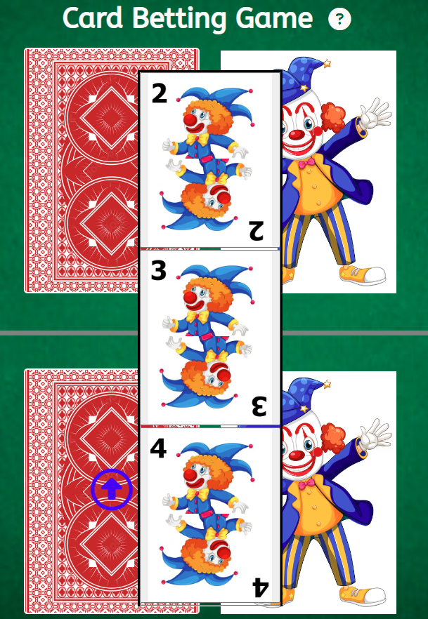

# Card Betting Game

Card Betting Game is a basic game in which the user selects a card to play against a randomly selected computer card. While the user can choose the card, the computer randomly selects one, canceling any hand tricks used in the actual game and ensuring a fair deal each time.

Users can use the game to hone their competitive skills in their spare time. This ensures that the user remains present while resting.

# Features

### Header

* The header, located at the top of the page, displays the game name: Card Betting Game in a font that stands out against the background. 
* This header provides the user with a clear and unambiguous indication of the specific game they are currently engaged in.
* Adjacent to the game name is an icon in the shape of a question mark. This icon, when clicked, displays the rules of the game.

### The Game Options

* The game options provide a concise set of instructions that are displayed when the question mark icon is clicked.

* Card selection can be accessed by clicking the blue arrow-up icon, which trasform when hovered with mouse pointer, inside the player unflipped card.
* There are alternatives ranging from cards 2 to 9. These options are interactive buttons that allow the user to select their choice by clicking on them.
* After the player selects a card, it will no longer be displayed as an option.

### The Game Results

* Upon user's selection, the corresponding card is displayed on player side of the game board.
* JaveScript code selects a random option for the Computer player, displays the image associated with the Computer's choice, and then determines who wins the round.
* The outcome is announced alongside the player score, and the score is updated for either the user or the computer, depending on who won the round.

### Game Reload

* When the cards are all played the game is concluded, an alert will drop when the reload icon, beside the computer score, is clicked.
* The player will be prompted to restart the game.

### Features Left to Implement

* When I have enough time, I will expand the selection to a full deck of cards, allowing the user to select three cards to play against the computer.
* Add end game option which lets the player knows who won the game as a whole.
* Define the username capability of the player to make the game more personalized.

# Testing

* This page works in different broswers such as; Google Chrome, Safari, Microsoft Edge and Firefox.
* The page is responsive, all links work and it all looks good on different standard screen sizes using devtools and testing out on different devices.
* I confirm that the header, instructions, options, results and notifications are all readable and easy to access and understand.

### Unfixed Bugs

* No unfixed bugs.

### Validator Testing

* HTML 
    * Four errors and four warning were found when validating through W3C validator.
        * Error: Element br not allowed as child of element ul in this context. Fixed through removing br element.
        * Error: Element p not allowed as child of element ul in this context. Fixed by transfering as child to div.
        * Two Errors: Stray end tag img. Fixed by removing the img end tag.
        * Four Warning: Section lacks heading. Consider using h2-h6 elements to add identifying headings to all sections, or else use a div element instead for any cases where no heading is needed. Fixed by replacing section element to div.

* CSS
    * No errors were found when passing through the official (Jigsaw) validator.

* Lighthouse
    * I have confirmed that the colors and fonts chosen are easy to read and accessible by running it through lighthouse in devtools.

# Deployment

* The site was deployed to GitHub pages. The steps to deploy are as follows:
In GitHub pages , navigate to the Settings tab.
    * Down the left hand side menu, navigate to the Pages tab.
    * Select the Main branch and select save.
    * The page will automatically refresh and the page link will appear at the top of the GitHub pages.
    * When a green tick appears it indicates a successful deployment.
    * The live link can be found here - [Simple Card Betting Game](https://gnaces.github.io/projectPortfolio2/).

# Credits

* Codes were mostly taken from the Portfolio Project Scope: ULTIMATE Rock Paper Scissors.
* Modals, score increment and game restart was mostly taken from [fredboys Rock-Paper-Scissors-Lizard-Spock](https://github.com/fredboys/Rock-Paper-Scissors-Lizard-Spock) project.
* Favicon steps is from Dani Krossing YouTube channel.
* Animation Code was learned from [Net Ninja YouTube Page](https://www.youtube.com/watch?v=B0_M1y4aFAQ).
* Hide choice button once clicked was learned from [HowToCodeSchool](https://www.youtube.com/watch?v=F_ASunccAro).

### Media

* Page background was taken from [stock.adobe.com](https://stock.adobe.com/uk/contributor/200900772/ievgen-skrypko?load_type=author&prev_url=detail) site.
* Joker image was taken from [Freepik.com](https://www.freepik.com/free-photos-vectors/joker-cartoon)
* Cards were crafted inside built-in microsoft paint app.

